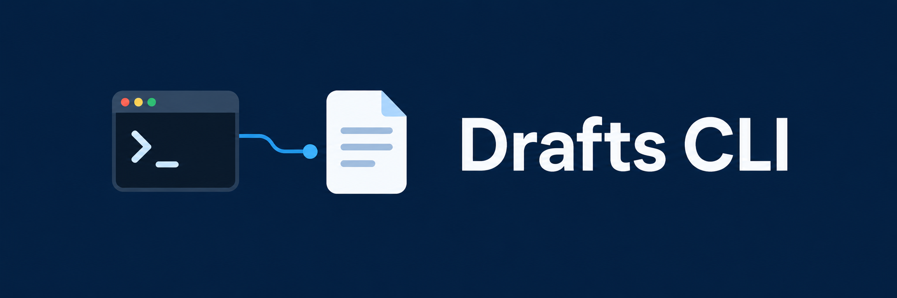

# Drafts CLI

Work with [Drafts](https://getdrafts.com) notes from your Mac's terminal. Create notes, find drafts, manage tags, and run actions. The CLI uses AppleScript. You do not need a helper app or helper action.

JSON output and a built-in command schema make it easy to use in scripts and with AI agents.

## Install

You need macOS, Drafts, and Drafts Pro for automation. Open Drafts before using commands that read or change notes.

Download the binary for your Mac from the [latest release](https://github.com/nerveband/drafts-applescript-cli/releases/latest). Put it in a folder on your `PATH`.

Or install with Go 1.24.11 or newer:

```sh
go install github.com/nerveband/drafts-applescript-cli/v4/cmd/drafts@latest
drafts version
drafts --help
```

Another Drafts tool may also use the name `drafts`. Check `command -v drafts` and `drafts version` to confirm which tool you are running.

When macOS asks, allow your terminal to control Drafts. You can change this in **System Settings > Privacy & Security > Automation**.

## Start here

Find the installed app and check which features it supports:

```sh
drafts apps
drafts schema --detected
```

List a few notes without fetching their full text:

```sh
drafts list --limit 5 --fields uuid,title,modifiedAt
```

To create a note, save this JSON as `payload.json`:

```json
{"content":"Example note","tags":["example"]}
```

Preview the request, then create it:

```sh
drafts create --input @payload.json --dry-run
drafts create --input @payload.json --idempotency-key notes-001
```

Use a new key for each new request. If a request times out, check `drafts jobs notes-001` before trying again.

## Change a note safely

Use the note's UUID from `drafts list`. The UUID below is only an example. Save the new text in `note.md`.

```sh
drafts get 12345678-1234-1234-1234-123456789abc --format raw
drafts replace -u 12345678-1234-1234-1234-123456789abc --text-file note.md --dry-run
drafts replace -u 12345678-1234-1234-1234-123456789abc --text-file note.md --commit
drafts trash 12345678-1234-1234-1234-123456789abc --dry-run
```

A preview checks the input. It does not read the target or prove that it exists. Replace and trash require an explicit UUID and `--commit`. Edit, workspace rename, and self-update also require `--commit`.

Actions can change or delete notes. Preview them first:

```sh
drafts run --input '{"action":"Copy","uuid":"12345678-1234-1234-1234-123456789abc"}' --dry-run
```

An action receipt means the action was submitted. It does not mean the action finished.

## Commands at a glance

| Task | Commands |
|---|---|
| Read notes | `get`, `list` |
| Write notes | `create` (`new`), `append`, `prepend`, `replace` (`update`), `edit` |
| Open notes | `open`, `select` (needs `fzf`) |
| Organize notes | `tag`, `remove-tags`, `flag`, `unflag`, `archive`, `inbox`, `trash` (`delete`) |
| Use actions and workspaces | `run`, `actions`, `workspace`, `workspaces`, `tags` |
| Save a local snapshot | `sync`, then `get` or `list` with `--data-source local` |
| Choose an app | `apps`, `info` |
| Set defaults | `profile`, `config` |
| Help agents | `schema` (`agent-context`), `skills`, `jobs`, `feedback` |
| Check or update the CLI | `version`, `upgrade` |

Use `drafts <command> --help` for options and examples. See the [CLI reference](docs/cli-reference.md) for filters, file output, profiles, snapshots, and exit codes.

## Stable and beta apps

The CLI checks the selected app's AppleScript dictionary to find supported features. A beta label alone does not enable them. Older apps keep the features they support, such as basic flags.

If you have more than one app installed, choose its exact path:

```sh
drafts --app /Applications/Drafts.app schema --detected
drafts --app '/Applications/Drafts Beta.app' schema --detected
```

Use your actual app path. Drafts' JavaScript APIs run inside Drafts; they are not all available to this CLI. See [feature coverage](FEATURE_GAP_ANALYSIS.md).

## For scripts and agents

- Start with `drafts schema` or `drafts schema <command>`. Read [the agent skill](skills/SKILL.md) for workflows.
- Success is JSON on stdout: `{"success":true,"data":...}`. Errors are JSON on stderr and use a nonzero exit code.
- Use explicit UUIDs. Limit reads with `--limit` and `--fields`. Add `--full` only when you need note text.
- Pass note text through `--text-file`, `--stdin`, or a JSON input file. Keep private text out of process arguments and logs.
- Preview changes with `--dry-run`. It sends no Apple events and writes no request receipt.
- Do not retry uncertain writes. Inspect the UUID and `jobs` receipt first. A blocked key must not be bypassed.
- `get --format raw` returns exact note text. `--format plain` gives readable output; `--format jsonl` gives list rows.
- Help, version, schema, profiles, and previews work while Drafts is closed. Library commands do not launch it for you.
- Feedback stays local. Snapshots may store note text. Keep state files private.

## Development

Build with Go 1.24.11 or newer:

```sh
make verify  # synthetic tests, vet, and build checks
make build
```

`cmd/drafts` handles commands, validation, output, and local state. `pkg/drafts` handles app detection and AppleScript. Note text is sent through stdin, not process arguments.

Default tests do not read your Drafts library. Live tests need explicit approval and the gates in [AGENTS.md](AGENTS.md). See the [CLI reference](docs/cli-reference.md#architecture-and-development) for optional checks and release steps, and [verification notes](docs/verification.md) for known limits.

## License

[MIT](LICENSE). Based on [ernstwi/drafts](https://github.com/ernstwi/drafts). Drafts is made by Agile Tortoise. This CLI is an independent project.
